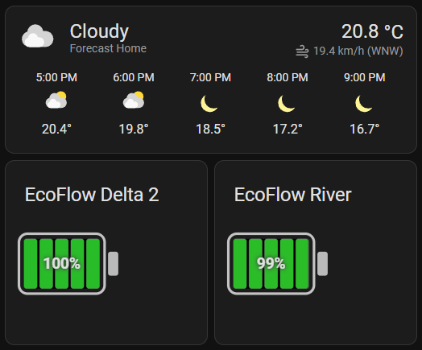

# Smart Battery Card for Home Assistant

<!-- Badges -->
<p align="left">
  <!-- Replace OWNER/REPO below when you publish to GitHub -->
  <a href="https://github.com/lemannrus/smart-battery-card/releases">
    
  </a>
  <a href="https://github.com/lemannrus/smart-battery-card/releases">
    
  </a>
  <a href="https://hacs.xyz/">
    
  </a>
  <a href="https://www.home-assistant.io/">
    
  </a>
  <a href="LICENSE">
    
  </a>
</p>

A custom Lovelace card for Home Assistant that displays battery levels with beautiful, animated circular battery indicators. Features smooth liquid-like fill animation with wave effects, multi-battery support, and intelligent outage management. Works with any battery sensor - EcoFlow, Jackery, Tesla Powerwall, or any other power station.

---

### Quick Install

[](https://my.home-assistant.io/redirect/hacs_repository/?owner=lemannrus&repository=smart-battery-card&category=plugin)

---

## ✨ Features

### Multi-Battery Support (NEW in v0.3.0) 🔋🔋
- **Multiple Batteries Display**: Show all your battery devices in one card
  - Dynamic vertical layout that automatically adjusts to the number of batteries
  - Single battery: centered display
  - Two batteries: left and right layout
  - Three or more: distributed grid layout
- **Individual Battery Monitoring**: Each battery shows its own:
  - Name and percentage
  - Remaining time (discharge or charge)
  - Power output
  - Status indicator (charging/discharging/idle)
- **Selected Battery for Outage Analysis**: Choose which battery to use for outage calculations
- **Unified Outage Information**: One outage display for all batteries

### Battery Display (v0.3.4 Design) 🌊
- **Circular Battery Design**: Beautiful circular indicators with liquid-like fill animation
  - Smooth fill from bottom to top with SVG clip-path technique
  - **Wave Effect**: Animated curved wave at the top of the liquid fill
  - Subtle pulsing animation creates natural liquid movement
  - Color-coded fill: Green (good), yellow (warning), red (critical)
- **Animated Status Indicator**: Pulsing rounded square badge below each battery
  - ↑ Square with up arrow when charging
  - ↓ Square with down arrow when discharging  
  - ⚡ Green square with lightning bolt when connected but idle
  - Smooth border and fill animations
- **In-Battery Information**: All key data visible at a glance
  - Battery name at the top
  - Large percentage display in the center
  - Remaining time (⏱ discharge or ⚡ charge) below percentage
- **Real-Time Power Display**: AC output power shown below status indicator with automatic W/kW formatting
- **Responsive Design**: Elements scale smoothly on all screen sizes using CSS clamp()

### Outage Management 🔌
- **Smart Outage Analysis**: Intelligent monitoring and recommendations for power outages
  - Compares battery remaining time vs outage duration
  - Calculates if you can fully charge before next outage
  - Color-coded alerts: Critical (red), Warning (yellow), Info (blue), OK (green)
- **Current Outage Display**: Shows active outage information
  - Outage end time with smart formatting (Today/Tomorrow)
  - Time remaining until power returns
  - Battery sufficiency warnings
- **Next Outage Preview**: Helps you prepare for scheduled outages
  - Next outage start time
  - Time until next outage
  - Required charging time calculation
- **Compatible with [HA Yasno Outages](https://github.com/denysdovhan/ha-yasno-outages)**: Perfect for Ukrainian users
  - Automatic integration with DTEK/Yasno outage schedules
  - No manual schedule configuration needed
  - Real-time outage status updates
- **Automated Recommendations**: Get actionable insights
  - "⚠️ Battery may run out before outage ends!"
  - "⏰ Start charging soon - limited time margin"
  - "✅ Battery sufficient for outage"

### General Features
- **Configurable Thresholds**: Customize when colors change based on your needs
- **Flexible Entity Support**: Works with any percentage-based sensor (0-100%)
- **HACS Compatible**: Easy installation through Home Assistant Community Store
- **No Build Step Required**: Single JavaScript file, ready to use
- **Home Assistant Theme Integration**: Automatically adapts to your HA theme colors
- **Responsive Design**: Scales beautifully across different screen sizes
- **Google Nest Hub Compatible**: CSS-based animations work seamlessly on Cast devices

## 🖼️ Screenshot



The card displays circular battery indicators with:
- Smooth circular fill animation from bottom to top
- Animated wave effect at the liquid surface
- Percentage and time information centered inside the circle
- Rounded square status indicator below with charging/discharging state
- Theme-aware colors (uses your HA theme CSS variables)

## 📦 Installation

### HACS (Recommended)

[](https://my.home-assistant.io/redirect/hacs_repository/?owner=lemannrus&repository=smart-battery-card&category=plugin)

**Or manually:**

1. Open HACS in your Home Assistant instance
2. Go to "Frontend" section
3. Click the "+" button and search for "Smart Battery Card"
4. Download and install the card
5. Add the resource to your Lovelace configuration (HACS usually handles this automatically)

### Manual Installation

1. Download the `smart-battery-card.js` file
2. Copy it to your `config/www/` directory
3. Add the resource to your Lovelace configuration:

```yaml
resources:
  - url: /local/smart-battery-card.js
    type: module
```

## 🔧 Configuration

### Basic Configuration (Single Battery)

```yaml
type: custom:smart-battery-card
batteries:
  - entity: sensor.ecoflow_battery_level
    name: "EcoFlow Delta 2"
```

### Advanced Configuration (Single Battery with Outage Monitoring)

```yaml
type: custom:smart-battery-card
batteries:
  - entity: sensor.delta_2_main_battery_level
    name: Delta 2
    remaining_time_entity: sensor.delta_2_discharge_remaining_time
    charge_remaining_time_entity: sensor.delta_2_charge_remaining_time
    ac_out_power_entity: sensor.delta_2_ac_out_power

# Outage integration entities
outage_status_entity: sensor.yasno_kiiv_dtek_2_2_electricity
outage_end_time_entity: sensor.yasno_kiiv_dtek_2_2_next_connectivity
next_outage_time_entity: sensor.yasno_kiiv_dtek_2_2_next_planned_outage

# Display settings
green: 60
yellow: 25
precision: 0
palette: gradient
```

### Multi-Battery Configuration (NEW in v0.3.0) 🔋🔋

```yaml
type: custom:smart-battery-card
batteries:
  - entity: sensor.delta_2_main_battery_level
    name: Delta 2
    remaining_time_entity: sensor.delta_2_discharge_remaining_time
    charge_remaining_time_entity: sensor.delta_2_charge_remaining_time
    ac_out_power_entity: sensor.delta_2_ac_out_power
  - entity: sensor.river_2_battery_level
    name: River 2
    remaining_time_entity: sensor.river_2_discharge_remaining_time
    charge_remaining_time_entity: sensor.river_2_charge_remaining_time
    ac_out_power_entity: sensor.river_2_ac_out_power

# Which battery to use for outage analysis (0 = first battery, 1 = second, etc.)
selected_battery: 0

# Outage integration entities (shared for all batteries)
outage_status_entity: sensor.yasno_kiiv_dtek_2_2_electricity
outage_end_time_entity: sensor.yasno_kiiv_dtek_2_2_next_connectivity
next_outage_time_entity: sensor.yasno_kiiv_dtek_2_2_next_planned_outage

# Display settings (applied to all batteries)
green: 60
yellow: 25
precision: 0
palette: gradient
```

**Note:** These examples use the [**HA Yasno Outages**](https://github.com/denysdovhan/ha-yasno-outages) integration for Ukrainian electricity outage information. Entity names will vary based on your city and DTEK group. Install it via HACS for automatic outage schedule tracking.

## ⚙️ Configuration Options

### Card-Level Options

| Option | Type | Default | Description |
|--------|------|---------|-------------|
| `batteries` | array | **Required** | Array of battery objects (see Battery Object below) |
| `selected_battery` | number | `0` | Which battery to use for outage analysis (0 = first, 1 = second, etc.) |
| `green` | number | `60` | Battery percentage threshold for green color (applied to all) |
| `yellow` | number | `25` | Battery percentage threshold for yellow color (applied to all) |
| `precision` | number | `0` | Number of decimal places for percentage display |
| `palette` | string | `threshold` | Color mode: `threshold` (red/yellow/green) or `gradient` |

### Battery Object (Array Item)

Each battery in the `batteries` array can have these properties:

| Option | Type | Default | Description |
|--------|------|---------|-------------|
| `entity` | string | **Required** | The entity ID of the battery sensor (0-100%) |
| `name` | string | `Battery N` | Display name for this battery |
| `remaining_time_entity` | string | `null` | Optional entity ID for discharge remaining time (in minutes) |
| `charge_remaining_time_entity` | string | `null` | Optional entity ID for charge remaining time (in minutes) |
| `ac_out_power_entity` | string | `null` | Optional entity ID for AC output power (in watts) |
| `invert` | boolean | `false` | Invert the battery reading (for sensors that report inversely) |

### Outage Integration Options

| Option | Type | Default | Description |
|--------|------|---------|-------------|
| `outage_status_entity` | string | `null` | Entity ID for current outage status. Supports states: `on`/`off`, `true`/`false`, `active`/`inactive`, `outage`/`connected`, `1`/`0` |
| `outage_end_time_entity` | string | `null` | Entity ID for outage end time. Supports ISO datetime format or Unix timestamp |
| `next_outage_time_entity` | string | `null` | Entity ID for next scheduled outage start time. Supports ISO datetime format or Unix timestamp |

**Version Notes:** 
- **v0.3.4**: Circular battery design with animated wave effect on liquid fill
- **v0.3.3**: Circular batteries + rounded square status indicators  
- **v0.3.2**: Responsive design with auto-scaling elements
- **v0.3.0**: Multi-battery support with vertical layout
- **v0.2.1+**: Direct use of `charge_remaining_time_entity` - no manual capacity config needed

## 🔌 Compatible Sensors

This card works with any Home Assistant sensor that reports battery levels as:
- **State value**: A number between 0-100
- **Battery attribute**: If state is not numeric, looks for `battery` attribute
- **Level attribute**: If neither state nor battery attribute found, looks for `level` attribute

### Example Sensor Types
- EcoFlow power station battery sensors
- Device battery levels
- UPS battery percentages
- Solar battery banks
- Any custom sensor reporting 0-100% values

## 🎨 Theming

The card automatically integrates with your Home Assistant theme using CSS custom properties:

- `--error-color`: Used for critical battery levels (red)
- `--warning-color`: Used for warning battery levels (yellow)  
- `--success-color`: Used for good battery levels (green)
- `--primary-text-color`: Used for text and battery outline
- `--card-background-color`: Used for card background
- `--divider-color`: Used for tick marks and borders

## 🔧 Integration Examples

### EcoFlow with Yasno (Ukrainian Outage Tracking)

Real-world example with EcoFlow Delta 2 and Yasno outage integration:

```yaml
type: custom:smart-battery-card
batteries:
  - entity: sensor.delta_2_main_battery_level
    name: EcoFlow Delta 2
    remaining_time_entity: sensor.delta_2_discharge_remaining_time
    charge_remaining_time_entity: sensor.delta_2_charge_remaining_time
    ac_out_power_entity: sensor.delta_2_ac_out_power
outage_status_entity: sensor.yasno_kiiv_dtek_2_2_electricity
outage_end_time_entity: sensor.yasno_kiiv_dtek_2_2_next_connectivity
next_outage_time_entity: sensor.yasno_kiiv_dtek_2_2_next_planned_outage
green: 60
yellow: 25
palette: gradient
```

The card will automatically show:
- 🔵 **Circular battery indicator** with:
  - Liquid-like fill animation from bottom to top
  - Animated wave effect at the surface
  - Color changes based on charge level (green/yellow/red)
- ⬜ **Rounded square status badge** below:
  - ↑ With up arrow when charging
  - ↓ With down arrow when discharging  
  - ⚡ Green with lightning when connected but idle
- 📊 **Inside the circle**:
  - Battery percentage in large text
  - ⏱ Discharge time when providing power (e.g., "5h 33min")
  - ⚡ Charge time when charging (e.g., "2h 15min")
- ⚡ **Power output** display below (e.g., "1.2 kW")

### Generic Battery Sensor

```yaml
type: custom:smart-battery-card
batteries:
  - entity: sensor.ups_battery_level  
    name: "UPS Battery"
green: 90
yellow: 50
```

## 🔌 Outage Integration Setup

### Overview

The outage integration helps you manage scheduled power outages (rolling blackouts) by:
1. **Monitoring** current outages and battery sufficiency
2. **Predicting** if you can charge before the next outage
3. **Alerting** you when action is needed
4. **Displaying** your outage schedule

### Compatible Integrations

#### ⚡️ HA Yasno Outages (Recommended for Ukraine)

For users in Ukraine affected by electricity outages, we recommend the [**HA Yasno Outages**](https://github.com/denysdovhan/ha-yasno-outages) integration by [@denysdovhan](https://github.com/denysdovhan).

**Features:**
- 📅 Automatic outage schedule tracking for all Ukrainian regions
- 🔌 Real-time electricity status monitoring
- ⏰ Next planned outage predictions
- 🏢 Supports multiple providers (DTEK, Yasno)
- 📊 Calendar view of planned outages

**Installation:**
1. Install via HACS (search for "Yasno Outages")
2. Configure your city and DTEK group
3. Use the provided sensors in your card configuration

**Sensor mapping for this card:**
- `sensor.yasno_*_electricity` → `outage_status_entity`
- `sensor.yasno_*_next_connectivity` → `outage_end_time_entity`
- `sensor.yasno_*_next_planned_outage` → `next_outage_time_entity`

*Replace `*` with your specific city and group (e.g., `kiiv_dtek_2_2`)*

---

### Required Sensors

To use outage features, you need to create template sensors in your Home Assistant configuration. Here are examples:

#### Example 1: Simple Scheduled Outages

```yaml
# configuration.yaml
template:
  - sensor:
      # Outage Status - assumes daily outage from 14:00-16:00
      - name: "Power Outage Status"
        unique_id: power_outage_status
        state: >
          
          
            on
          
            off
          
      
      # Outage End Time
      - name: "Power Outage End Time"
        unique_id: power_outage_end_time
        state: >
          
          {{ today.replace(hour=16, minute=0).isoformat() }}
      
      # Next Outage Time
      - name: "Next Power Outage"
        unique_id: next_power_outage
        state: >
          
          
          
            {{ today.replace(hour=14, minute=0).isoformat() }}
          
            {{ (today + timedelta(days=1)).replace(hour=14, minute=0).isoformat() }}
          
```

#### Example 2: Integration with External API

If you have an integration that provides outage data (e.g., utility company API):

```yaml
# configuration.yaml
template:
  - sensor:
      - name: "Outage Status"
        state: "{{ states('binary_sensor.utility_outage') }}"
      
      - name: "Outage End Time"
        state: "{{ state_attr('sensor.utility_data', 'outage_end') }}"
      
      - name: "Next Outage Time"
        state: "{{ state_attr('sensor.utility_data', 'next_outage_start') }}"
```

#### Example 3: Yasno Integration (Ukrainian DTEK)

If you're using the [**HA Yasno Outages**](https://github.com/denysdovhan/ha-yasno-outages) integration by [@denysdovhan](https://github.com/denysdovhan) for Ukrainian electricity outage tracking (DTEK), you can use the sensors directly:

```yaml
type: custom:smart-battery-card
batteries:
  - entity: sensor.delta_2_main_battery_level
    name: EcoFlow Delta 2
    remaining_time_entity: sensor.delta_2_discharge_remaining_time
    charge_remaining_time_entity: sensor.delta_2_charge_remaining_time
    ac_out_power_entity: sensor.delta_2_ac_out_power

# Yasno/DTEK sensors (replace with your city/group)
outage_status_entity: sensor.yasno_kiiv_dtek_2_2_electricity
outage_end_time_entity: sensor.yasno_kiiv_dtek_2_2_next_connectivity
next_outage_time_entity: sensor.yasno_kiiv_dtek_2_2_next_planned_outage
```

**Installation:** Install [HA Yasno Outages](https://github.com/denysdovhan/ha-yasno-outages) via HACS. After setup, it provides sensors for electricity status, connectivity times, and planned outages. Entity names vary by city and DTEK group (e.g., `yasno_kiiv_dtek_2_2` for Kyiv, Group 2.2).

### Full Card Configuration with Outage Features

```yaml
type: custom:smart-battery-card
batteries:
  - entity: sensor.ecoflow_battery_level
    name: "EcoFlow Delta 2"
    remaining_time_entity: sensor.delta_2_discharge_remaining_time
    charge_remaining_time_entity: sensor.delta_2_charge_remaining_time
    ac_out_power_entity: sensor.delta_2_ac_out_power

# Outage integration sensors
outage_status_entity: sensor.power_outage_status
outage_end_time_entity: sensor.power_outage_end_time
next_outage_time_entity: sensor.next_power_outage

# Display settings
green: 80
yellow: 40
palette: gradient
```

### Understanding the Analysis

The card provides intelligent analysis and warnings:

#### 🔴 **Critical Alert** (Red, Pulsing)
```
⚠️ Battery may run out 45m before outage ends!
```
**What it means**: Your battery's remaining discharge time is less than the outage duration. You need to reduce power consumption or the battery will die before power returns.

**Action**: Turn off non-essential devices immediately.

#### 🟡 **Warning** (Yellow)
```
⚡ Battery sufficient, but only 15m spare time
```
**What it means**: Battery will last through the outage, but with less than 30 minutes buffer.

**Action**: Monitor your power usage carefully. Consider turning off some devices.

#### 🔵 **Info** (Blue)
```
⏰ Start charging soon - 1h 15m margin
```
**What it means**: You have time to charge, but not much extra time. You should start charging within the next hour.

**Action**: Connect to power and start charging if not already doing so.

#### 🟢 **OK** (Green)
```
✅ Battery sufficient for outage (1h 23m spare)
```
**What it means**: You're all set! Battery will comfortably last through the outage.

**Action**: No immediate action needed.

### Charging Time Analysis

The card uses your EcoFlow's `charge_remaining_time_entity` sensor for accurate charging time predictions. This is more accurate than calculations because it accounts for:
- Current charging power (varies with AC/solar/car input)
- Battery temperature and condition
- Charging curve (batteries charge slower near 100%)
- Real-time charging rate

### Tips for Best Results

1. **Configure All Sensors**: For best analysis, configure all three time sensors:
   - `remaining_time_entity` - Battery discharge time
   - `charge_remaining_time_entity` - Battery charge time
   - Both sensors enable accurate outage vs battery analysis

2. **Reliable Outage Data**: Ensure your outage sensors provide accurate information
   - Use official utility company integrations (like Yasno for Ukraine)
   - Verify timezone configuration in Home Assistant
   - Test sensors before relying on them during outages

3. **Safety Margins**: The card recommends charging when there's still time margin
   - ✅ Green status: 30+ minutes spare time
   - ⚠️ Warning: Less than 30 minutes spare time
   - Plan to start charging before warnings appear

4. **Power Consumption**: The analysis is based on current usage
   - High AC output = faster battery drain = shorter remaining time
   - Turn off non-essential devices during critical situations
   - Monitor the AC output power display

## 🐛 Troubleshooting

### Card Not Showing
- Ensure the resource is properly added to your Lovelace configuration
- Check the browser console for JavaScript errors
- Verify the entity exists and has a numeric state or battery/level attribute

### Wrong Battery Reading
- Check if your sensor reports values in the expected range (0-100)
- If your sensor reports inversely (0=full, 100=empty), set `invert: true`
- Verify the entity name is correct in your configuration

### Styling Issues
- Clear your browser cache and hard refresh (Ctrl+F5)
- Check if your Home Assistant theme defines the required CSS custom properties

### Outage Features Not Working
- **No outage information showing**: Verify that your outage sensor entities exist and have valid states
  - Check sensor states in Developer Tools → States
  - Ensure entity IDs match your configuration exactly
- **Wrong outage times**: Check datetime format in your sensors
  - Use ISO format: `2025-11-13T14:30:00` or Unix timestamps
  - Verify your timezone is configured correctly in Home Assistant
  - Check Developer Tools → States to verify sensor values
- **Analysis messages not appearing**:
  - Ensure `charge_remaining_time_entity` is configured for charging analysis
  - Ensure `remaining_time_entity` is configured for discharge analysis
  - Check that time sensors report values in minutes (not seconds/hours)
  - Verify outage status sensor returns 'on'/'off' or similar states
  - Use Developer Tools → States to verify all sensor states

## 🤝 Contributing

Contributions are welcome! Please feel free to submit issues, feature requests, or pull requests.

## 📄 License

This project is licensed under the MIT License - see the [LICENSE](LICENSE) file for details.

## 🙏 Credits

- **Author**: Alex Hryhor ([@lemannrus](https://github.com/lemannrus))
- Built with Lit-based components for seamless Home Assistant integration
- Designed for the Home Assistant community
- HACS compatible for easy distribution and updates
- Special thanks to [@denysdovhan](https://github.com/denysdovhan) for the [HA Yasno Outages](https://github.com/denysdovhan/ha-yasno-outages) integration

---

*Made with ❤️ for the Home Assistant community*
